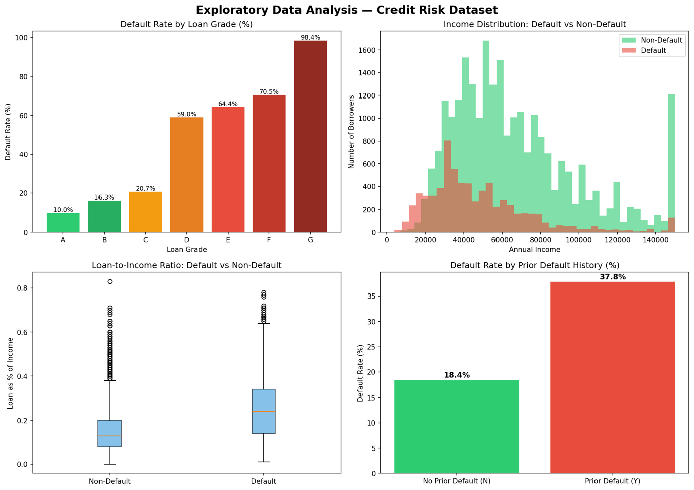
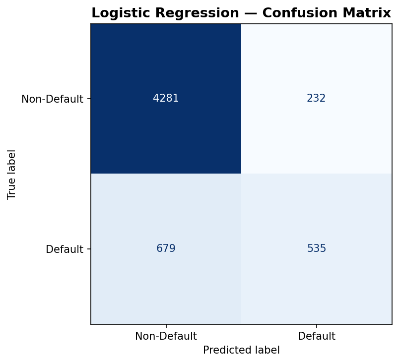
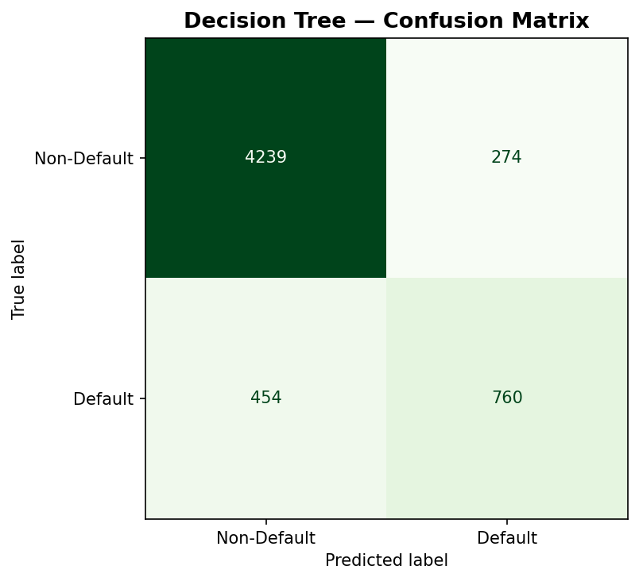
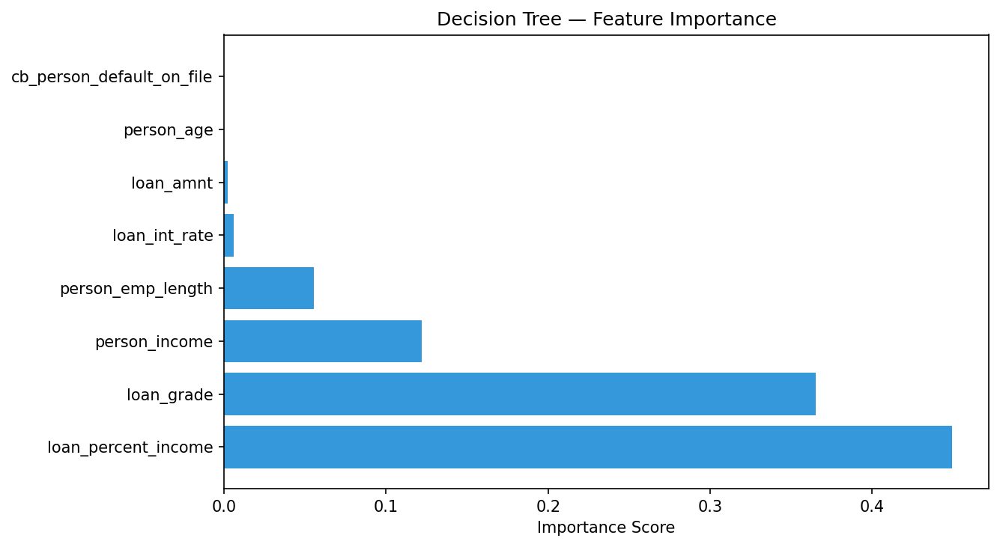

# Credit Risk: Loan Default Prediction
**Dilip Singh Rajpurohit | MSc Business Analytics | University of Law**

An academic Python project exploring borrower characteristics associated with loan default and comparing logistic regression with a decision tree classifier.
## Original Python Analysis
[View my model-training code and results](credit-risk-original-analysis.ipynb)

## Business question
Which borrower characteristics are associated with default, and how well can two interpretable models identify defaulting borrowers?

The intended audience is a credit risk team investigating potential tools for underwriting support. This is an academic case study, with no live lending deployment or measured reduction in financial losses.

## Project at a glance
| Item | Description |
| --- | --- |
| Dataset | Credit Risk Dataset, attributed to Laotse on Kaggle |
| Raw size | 32,581 rows and 12 columns, as documented in the academic report |
| Target | `loan_status`: 0 = non-default, 1 = default, using the report's convention |
| Tools reported | Python, Google Colab, scikit-learn and SciPy |
| Methods | Data cleaning, exploratory analysis, logistic regression, decision tree, independent-samples income t-test |
| Split reported | 80% training / 20% test |
| Evidence available here | Eight original figures and a reproducible audit of their confusion-matrix metrics |
| Original model code | Linked below; Included in credit-risk-original-analysis.ipynb; the dataset is not included. |

## Exploratory analysis


The supplied figure shows increasing default rates across loan grades A-G, higher loan-to-income ratios among defaulters, and a higher observed default rate for borrowers with prior defaults (37.9% versus 18.4%). These are descriptive associations, not causal findings.

## Model performance
The table below is recalculated from the counts visible in the original confusion matrices. It resolves the report's approximate prose values of 82% and 85%, which differ from the figures. No model training was rerun during this portfolio review.

| Model | Accuracy | Default precision | Default recall | Default F1 |
| --- | ---: | ---: | ---: | ---: |
| Logistic regression | 84.09% | 69.75% | 44.07% | 54.01% |
| Decision tree | 87.29% | 73.50% | 62.60% | 67.62% |

Both figures contain 5,727 test observations: 4,513 non-defaults and 1,214 defaults. A classifier predicting non-default for everyone would achieve **78.80% accuracy** on this set and **0% default recall**. This is a calculated majority-class reference, not a comparison with an actual bank's scorecard.




The decision tree identifies 760 of 1,214 defaults, compared with 535 for logistic regression. It misses 454 defaults instead of 679, but flags 274 non-defaults instead of 232. Whether that trade-off is useful depends on the costs of missed defaults and unnecessary reviews.

## Main findings
- **Loan-to-income ratio and loan grade matter in the displayed tree.** Its importance chart ranks loan-to-income ratio first, loan grade second and income third. Importance is specific to this fitted model.
- **The tree offers an explainable decision structure.** Its first split uses a loan-to-income ratio around 0.305; this is a learned split, not a recommended lending cutoff.
- **Income differs between outcome groups in the supplied analysis.** The report gives `p < 0.001` from an independent-samples t-test. The statistic, confidence interval, assumptions and exact p-value require the original notebook to verify.
- **Accuracy is incomplete evidence.** Even the better-performing tree misses 37.40% of observed defaults in this test set.



## Business recommendations
1. Evaluate the models as decision-support prototypes, with human review rather than automatic approval or rejection.
2. Choose thresholds using a documented business cost model and validation data.
3. Test probability calibration, out-of-time performance and relevant subgroup outcomes before operational use.
4. Investigate income, grade and loan-to-income patterns without treating dataset associations as universal lending rules.

## Methods and limitations
The academic report describes removing missing employment-length/interest-rate records, filtering ages over 100 and label-encoding categories. These steps are reported methods, not independently reproduced here.

The report refers to about 28,000 cleaned rows. The displayed tree has 22,906 training samples and the confusion matrices have 5,727 test samples, implying 28,633 observations if they share one run. The exact cleaning count, random seed, feature set and model settings need confirmation from the original code. Twelve dataset columns do not mean twelve predictors when one is the target; eight predictors appear in the supplied coefficient/importance charts.

Further limitations include unverified dataset provenance/licence, no external validation, no probability calibration or fairness assessment, and unconfirmed missing-data assumptions. Nominal categories should not be assigned arbitrary numeric order in a future modelling pipeline. Raw logistic coefficients on different scales should not be used as a general feature-importance ranking.

The income figure includes a currency symbol, but the dataset currency has not been verified. Treat values as dataset units. A displayed p-value of `0.000000` is rounding, not a probability exactly equal to zero.

## Explore the project
- [Portfolio case study](portfolio-case-study.md)
- [Technical review and improvement plan](technical-review.md)
- [Data source and variable notes](DATA-SOURCE.md)
- [Metric evidence (CSV)](confusion-matrix-metrics.csv)
- [Executed metric-audit notebook](metrics-evidence-audit.ipynb)
- [Metric-audit script](audit_metrics.py)
- [Original Colab notebook linked in the report](https://colab.research.google.com/drive/1gddFnsGvNPTPWUdctya3i0DZbExL7nj0?usp=sharing)

## Run the evidence audit
Requires Python 3.9+; no third-party libraries are needed for the script.

```bash
python audit_metrics.py
```

This calculates metrics from transcribed figure counts and writes the CSV in ``. It does not train a classifier or reproduce the income test. 
## Attribution
Original analysis and figures: Dilip Singh Rajpurohit, Data Analysis for Business (BS657), report dated 28 May 2026. Portfolio documentation and the supplementary metric audit were prepared with AI assistance; the audit is an addition to the academic work, not the original training code.

Dataset: [Laotse, Credit Risk Dataset, Kaggle](https://www.kaggle.com/datasets/laotse/credit-risk-dataset). No raw dataset is redistributed here. No open-source licence has been assigned to the original work or third-party materials.
